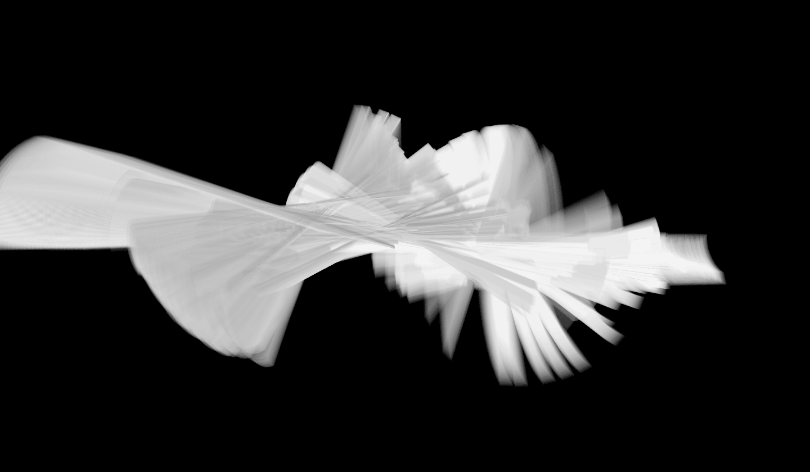
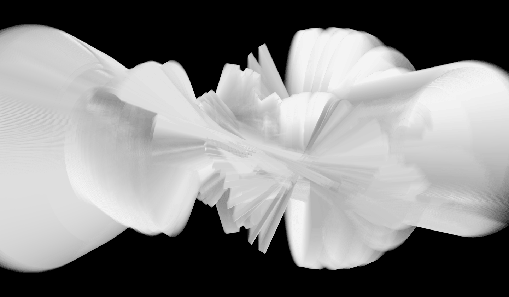

## Twiz Abstractions

A software for abstract data renderings using recordings captured from the Twiz motion sensor. Each data point is translated into a visual element, an elongated cube. These visual elements are then rendered from left to right. The orientation for each element is determined by the yaw, pitch and roll data of the corresponding data point. While the visual elements are rendered onto the screen, they leave a trail over time which results in a 3D volume repsenting the recorded data as a visual abstraction. Individual frames can be saved as an image by pressing key s while the program is running.

built with [processing](http://www.processing.org), 3.0.2.

_Twiz Abstractions_ is part of the _Movement of Things_ project.

(c) 2016
