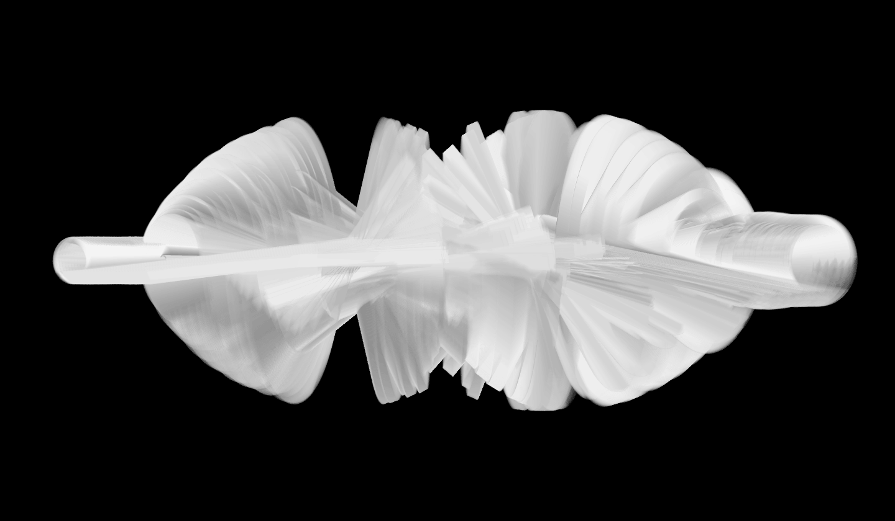

# Movement Of Things 

## Exploring Inertial Motion Sensing When Autonomous, Tiny and Wireless

Andreas Schlegel, Cedric Honnet

The Movement of Things project is an exploration into the qualities and properties of movement. Through a range of exercises these movements are captured and translated by custom-built software and the use of an autonomous, tiny and wireless motion sensor. A series of Motion Sensing Extensions suggest different approaches of how to use a motion sensor within various physical environments to capture movement to better understand the materialization of movement and new forms of interactions through movement.

The objective of the project is to collect the acceleration and orientation properties of moving objects and express them ar- tistically. We have tested the Movement of Things in two different scenarios, a recorded and a real-time scenario.

__Recording Scenario__

The recorded scenario took place in May 2015 in Paris where various subjects found in an urban environment were mea- sured, including an air vent, washing machine, dryer, escalator, trees, water, doors or the metro. Later, the recorded data was interpreted through abstract  data renderings and trans- lated into a kinetic object animated by data recordings.

_The Twiz motion sensor mounted onto a Motion Sensing Extension (left), and attached to the branch of a tree to capture the move- ment of the wind swaying through the leaves (right)._

_Abstract data renderings using data recordings captured with the Twiz motion sensor._

(c) 2016

